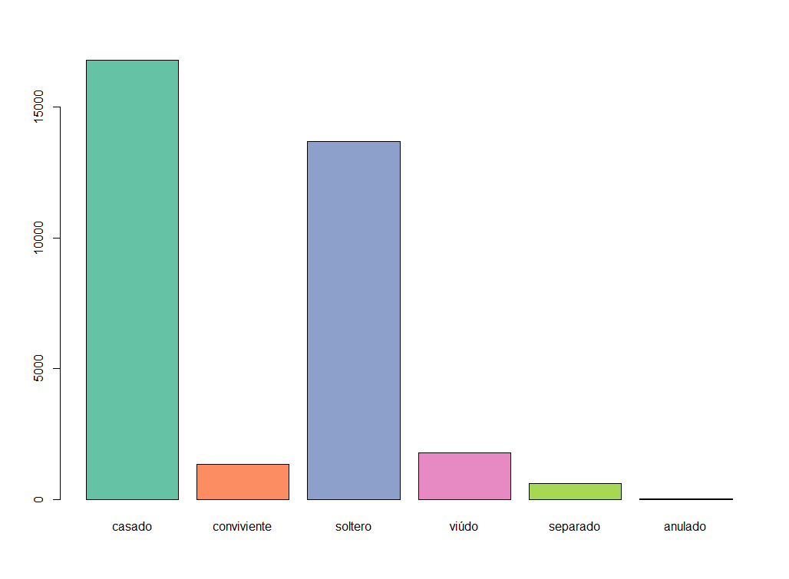

```{r, include = FALSE}
knitr::opts_chunk$set(
  collapse = TRUE,
  comment = "#>"
)
```

``` r
library(redatamx)
```

After opening a dictionary, you can execute a SPC command using `redatam_query`

``` r
# Open NMIR database
dic<-redatam_open('path/to/nmiresp.rxdb')

# Run a frequency 'freq person.ecivil'
t<-redatam_query(dic, "freq person.ecivil")
colnames(t)<-c("code","label","value")
print(t)
```

The output of the last command is:

```
##   code       label value
## 1    1      casado 16789
## 2    2 conviviente  1346
## 3    3     soltero 13676
## 4    4      viúdo   1781
## 5    5    separado   610
## 6    6     anulado    22
```

As you can see, there are 3 columns in the generated dataframe:

* SEXO1_value (code)
* SEXO1_label (label)
* value (value)

We can also generate plot graphs, the `RColorBrewer` package is used:

```r
library(RColorBrewer) # for colors

coul <- brewer.pal(5, "Set2")
barplot(height=t$value, names=t$label, col=coul)
```

<!-- -->

If you need to run a 2-dimensional table, you can execute a SPC command using `redatam.query`. The next exmaple, run a crosstab `person.ecivil by person.sexo`, next rename the columns- of the generated dataframe, and finally print the dataframe:

```r
# Run a crosstab 'freq person.ecivil by person.sexo'
t2<-redatam_query(dic, "freq person.ecivil by person.sexo")

# rename the columns
colnames(t2)<-c("evalue","elabel","svalue","slabel","value")

# print the dataframe
print(t2)
```
	
The output of the above example is:

```
##    evalue      elabel svalue slabel value
## 1       1      casado      1 Hombre  8386
## 2       1      casado      2  Mujer  8403
## 3       2 conviviente      1 Hombre   637
## 4       2 conviviente      2  Mujer   709
## 5       3     soltero      1 Hombre  7597
## 6       3     soltero      2  Mujer  6079
## 7       4       viúdo      1 Hombre   506
## 8       4       viúdo      2  Mujer  1275
## 9       5    separado      1 Hombre   249
## 10      5    separado      2  Mujer   361
## 11      6     anulado      1 Hombre     5
## 12
```

Finally, if you need to make a crosstable, you can use R built-in functions:	

```r
t2_cross<-as.data.frame.matrix( xtabs(t2$value~t2$elabel+t2$slabel) )

# calculate totals
t2_cross<-cbind(t2_cross, Total=rowSums(t2_cross))
t2_cross<-rbind(t2_cross, Total=colSums(t2_cross))

# print the results
print(t2_cross)
```

The output of the last command is:

```
##             Hombre Mujer Total
## anulado          5    17    22
## casado        8386  8403 16789
## conviviente    637   709  1346
## separado       249   361   610
## soltero       7597  6079 13676
## viúdo          506  1275  1781
## Total        17380 16844 34224
```

In the next block of code, you can find the whole program:

```r
# load the Redatam package
library(redatam)

# open dictionary
dic<-redatam_open("path/to/nmiresp.rxdb")

# Run a crosstab 'freq person.ecivil by person.sexo'
t2<-redatam_query(dic, "freq person.ecivil by person.sexo")

# rename the columns
colnames(t2)<-c("evalue","elabel","svalue","slabel","value")

# make a cross-table
t2_cross<-as.data.frame.matrix( xtabs(t2$value~t2$elabel+t2$slabel) )

# calculate totals
t2_cross<-cbind(t2_cross, Total=rowSums(t2_cross))
t2_cross<-rbind(t2_cross, Total=colSums(t2_cross))

# print the results
print(t2_cross)
```

## Generate a pivot-table

We can use the `pivottabler` library for building a crosstab. In the next exmaple, 
we generate a 3-dimensional Redatam crosstab `freq person.sexo by person.ecivil by person.alfab` 
and then generate a pivot-table:

```r
# Run a crosstab 'req person.sexo by person.ecivil by person.alfab'
t3<-redatam_query(dic, "freq person.sexo by person.ecivil by person.alfab")

# rename the columns
colnames(t3)<-c("svalue", "slabel", "evalue", "elabel", 
	"avalue", "alabel", "value" )
	
# print the results	
print(t3)
```

The output of the last command is:

```
##    svalue slabel evalue      elabel avalue     alabel value
## 1       1 Hombre      1      casado      1   Alfabeto  1540
## 2       1 Hombre      1      casado      2 Analfabeto  1452
## 3       1 Hombre      2 conviviente      1   Alfabeto   128
## 4       1 Hombre      2 conviviente      2 Analfabeto   132
## 5       1 Hombre      3     soltero      1   Alfabeto   650
## 6       1 Hombre      3     soltero      2 Analfabeto   949
## 7       1 Hombre      4       viúdo      1   Alfabeto   140
## 8       1 Hombre      4       viúdo      2 Analfabeto   195
## 9       1 Hombre      5    separado      1   Alfabeto    61
## 10      1 Hombre      5    separado      2 Analfabeto    46
## 11      1 Hombre      6     anulado      2 Analfabeto     1
## 12      2  Mujer      1      casado      1   Alfabeto  1384
## 13      2  Mujer      1      casado      2 Analfabeto  1307
## 14      2  Mujer      2 conviviente      1   Alfabeto   137
## 15      2  Mujer      2 conviviente      2 Analfabeto   161
## 16      2  Mujer      3     soltero      1   Alfabeto   411
## 17      2  Mujer      3     soltero      2 Analfabeto   548
## 18      2  Mujer      4       viúdo      1   Alfabeto   276
## 19      2  Mujer      4       viúdo      2 Analfabeto   474
## 20      2  Mujer      5    separado      1   Alfabeto    57
## 21      2  Mujer      5    separado      2 Analfabeto    68
## 22      2  Mujer      6     anulado      1   Alfabeto     3
```

Next, you can generate a pivot-table using the `pivottabler` package:

```r
library(pivottabler) # for pivot tables

# generate the pivot table
pt = qpvt( t3, rows = c("slabel","elabel"), columns = "alabel", "sum(value)" )

# print the pivot table
print(pt)

# If you want to render the pivot table as a html-widgets, use
# qhpvt( t3, rows = c("slabel","elabel"), columns = "alabel", "sum(value)" )
```

*If you want to render the pivot table, please uncomment the last line of code*

The output of the last command is a pivot table:

```
##                      Alfabeto  Analfabeto  Total  
## Hombre  anulado                         1      1  
##         casado           1540        1452   2992  
##         conviviente       128         132    260  
##         separado           61          46    107  
##         soltero           650         949   1599  
##         viúdo            140         195    335  
##         Total            2519        2775   5294  
## Mujer   anulado             3                  3  
##         casado           1384        1307   2691  
##         conviviente       137         161    298  
##         separado           57          68    125  
##         soltero           411         548    959  
##         viúdo             276         474    750  
##         Total            2268        2558   4826  
## Total                    4787        5333  10120
```

## Export to excel file

If you wnat to export to an EXCEL file, you can use the `openxlsx` package:

```r
library(openxlsx) # for writing excel files

wb <- createWorkbook(creator = Sys.getenv("USERNAME"))
addWorksheet(wb, "Data")
pt$writeToExcelWorksheet(wb=wb, wsName="Data",
                         topRowNumber=1, leftMostColumnNumber=1, 
						 applyStyles=TRUE)
saveWorkbook(wb, file="C:/BASES/test.xlsx", overwrite = TRUE)
```

In the next block of code, you can find the whole program that generates and export a pivot table:

```r
library(redatam) # Redatam package
library(pivottabler) # for pivot tables
library(openxlsx) # for writing excel files

# open dictionary
dic<-redatam_open("path/to/nmiresp.rxdb")

# Run a crosstab 'req person.sexo by person.ecivil by person.alfab'
t3<-redatam_query(dic, "freq person.sexo by person.ecivil by person.alfab")

# rename the columns
colnames(t3)<-c("svalue", "slabel", "evalue", "elabel", 
	"avalue", "alabel", "value" )
	
# generate the pivot table
pt = qpvt( t3, rows = c("slabel","elabel"), columns = "alabel", "sum(value)" )

# export to excel
wb <- createWorkbook(creator = Sys.getenv("USERNAME"))
addWorksheet(wb, "Data")
pt$writeToExcelWorksheet(wb=wb, wsName="Data",
                         topRowNumber=1, leftMostColumnNumber=1, 
						 applyStyles=TRUE)
saveWorkbook(wb, file="C:/BASES/test.xlsx", overwrite = TRUE)
```


